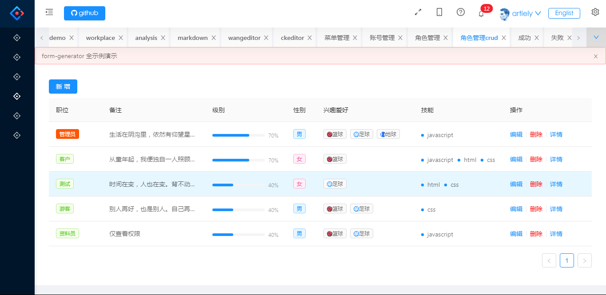
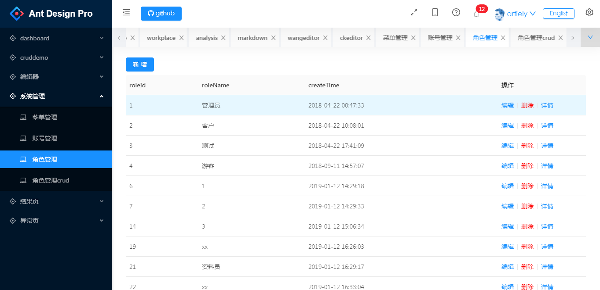
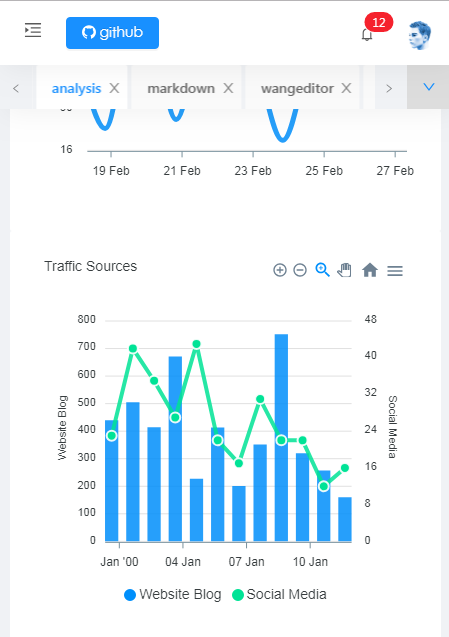
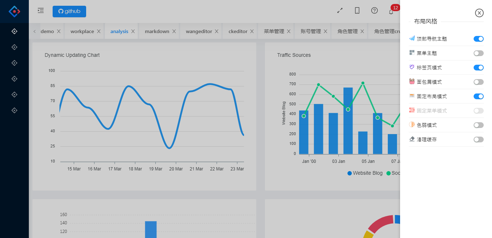
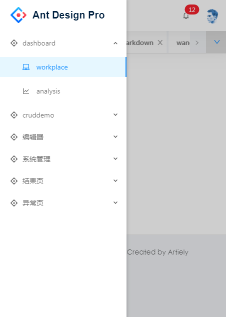

# antd-admin

> 个人项目 兴趣使然 业余时间开发，间歇性维护更新，目前测试 beta 版本
> antd-admin 基于 vue、ant-design-vue 构建开发，实现后台管理前端功能，提供一套更优的前端解决方案,能够让 Vue 开发者也享受到 Ant Design 的优秀设计

# feature

- [x] 演示地址：[http://120.78.174.212:8888/](http://120.78.174.212:8888/) (个人测试服务器，随时无法访问,免费cdn也存在不稳定性)
- [x] 真实接口
- [x] 前后端分离，通过 token 进行数据交互，可独立部署
- [x] pm2 本地一键部署
- [x] 主题定制，通过 less 变量统一一站式定制
- [x] 动态菜单，通过菜单管理统一管理访问路由，菜单按模块划分
- [x] 通用权限控制
      菜单级权限控制
      接口级权限控制
      元素级权限控制
- [x] 真实后端数据支持
- [x] 网络异常处理
- [x] 登录/登出
- [x] 自定义布局设置
- [x] 自定义主题设置
- [x] 标签页导航
- [x] 全屏/退出全屏
- [x] 面包屑模式
- [x] 深度响应式
- [x] ie9+支持
- [x] 多国语言支持
- [x] 基础组件库
- [x] 业务组件库
- [x] 富文本编辑器
- [x] markdown 编辑器
- [x] 内置 Markdown 拓展
- [x] 内置 form-generator 拓展
- [x] 发布时，可动态配置 CDN 静态资源／切换新旧版本
- [ ] iframs 支持(废弃)
- [ ] 色弱模式
- [ ] 数据切换，通过 mock 配置对接口数据／mock 模拟数据进行切换

# 使用

``` bash
# 克隆
git clone https://github.com/artiely/antd-admin.git

# 安装依赖
npm install

# 开发环境启动
npm run dev

# 打包
npm run build

# 依赖分析 dist/report.html
npm run report
```

# 项目介绍

## 项目结构

``` bash
├─dist # 打包后的资源文件
│  └─static
│      ├─css
│      ├─fonts
│      ├─img
│      └─js
├─public # 无需编译的静态资源
│  └─static
│      └─js
├─docs # 文档
├─src # 项目源代码
│  ├─api # 接口
│  │  └─modules
│  ├─common # 公用方法（包含指令和过滤器）
│  ├─assets # 静态资源
│  │  ├─img
│  │  └─style
│  ├─components # 业务公用组件
│  │  └─layout
│  ├─i18n  # 国际化
│  ├─package # 基础组件（解耦业务）
│  │  └─Layout
│  ├─store # 全局状态管理
│  │  └─modules
│  ├─utils # 公用工具方法
│  ├─router # 路由相关配置
│  └─views # 视图页面
│      ├─auth
|          ├─template #业务组件
│      ├─sys
└─tests    # 测试
    ├─e2e
    │  ├─plugins
    │  ├─specs
    │  └─support
    └─unit
```

## 配置需求

Node.js >= 10.x
NPM >= 6.x

## 预览









